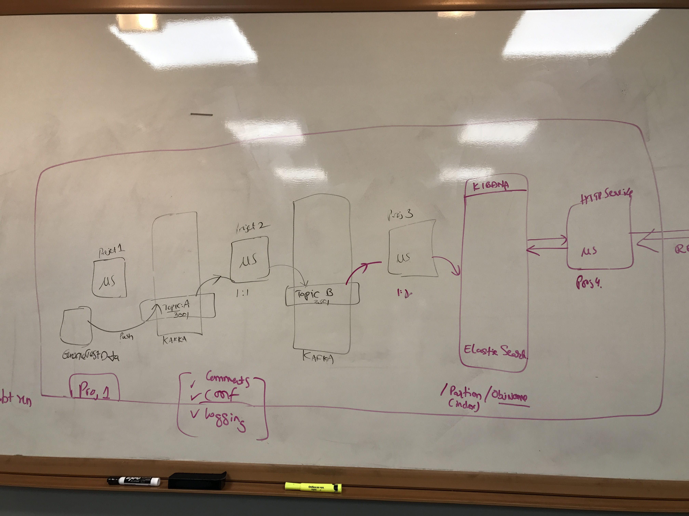

# Capstone Project
High level architecture of the Micro-services based system

## Architecture

### Stage/Project 1: Micro-Service to ingest data from a flat file to Kafka
* [Genome sample data set hosted by Google here](https://storage.cloud.google.com/genomics-public-data/1000-genomes/other/sample_info/sample_info.csv) shall be used as the sample ingest data.
* File location, file name shall be configurable
* Topic name, Kafka stream end points shall be configurable

### Stage/Project 2: Micro-Service to consume Kafka stream on a configured topic to enhance the data and add to a new topic.
* Input topic for the raw data stream and output topic for the enhanced data stream shall be configurable
* Kafka end points shall be configurable

### Stage/Project 3: Micro-Service to consume enhanced data records from Kafka stream and ingest to Elastic Search
* Input topic for the enhanced data stream shall be configurable
* End points for the Elastic Search shall be configurable
* Partition/Index/Object Types shall be configurable

### Stage/Project 4: HTTP Micro-Service that offers API to search for data stored in Elastic Search
* Elastic Search end points shall be configurable
* HTTP Endpoints shall be configurable
* Must list APIs offered by the service

## Acceptance Criteria
* Must submit fully functional working application
* All aspects of each Micro-service must be configurable via configuration file
* Must provide single task command to bring all Micro-services to action, in a Docker container
* Must include README.md file at the top level of project that include key description of the project, build and run instructions and must highlight salient points of the implementation.
* Must include README.md file at the top level of each individual Micro-service with description, build, run and dependency information
* Must list any library dependencies
* Must include comments to explain key decisions taken in the design of the application, in code.
